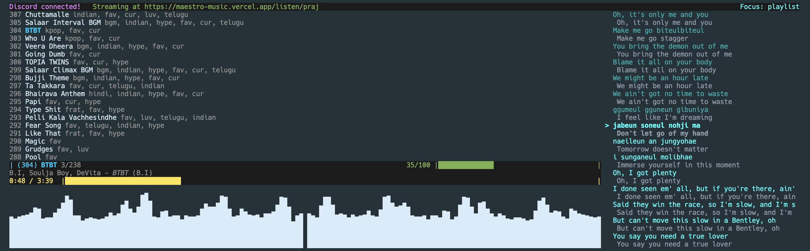
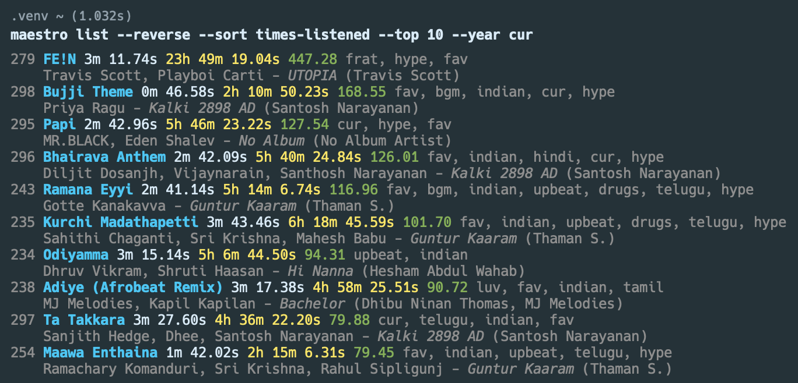

# maestro
[](https://pepy.tech/project/maestro-music) [](https://badge.fury.io/py/maestro-music) [](https://discord.gg/AW8fh2QEav)

`maestro` is a command-line tool to play songs (or any audio, really) in the terminal.

Check out the [Discord server](https://discord.gg/AW8fh2QEav)!

## Features

- cross-platform!
- add songs directly from YouTube, YouTube Music, or Spotify!
- audio visualization directly in the terminal! 
- Discord integration!


- Mac integration (Touch Bar, Now Playing center, headphone controls)! 
- [clips!](#maestro-clip)
- shuffle! (along with precise control over the behavior of shuffling when repeating)
- filter by [tags](#usage)!

## Installation

Make sure you have Python 3 and `pip` installed.

First, run
```
pip install maestro-music
```

**NOTE**: `pip install maestro` and `pip install maestro` will NOT work, they are totally unrelated PyPI packages.

Now, if you want to be able to directly download songs from YouTube or Spotify, you'll need to install [FFmpeg](https://github.com/FFmpeg/FFmpeg). You can also download the songs yourself and pass the path to the downloaded file to `maestro add`.

### Installing FFmpeg

**EASIEST**: `conda install -c conda-forge ffmpeg`

But if you don't want to get `conda`, here are the instructions for each platform:

#### macOS
Requires [Homebrew](https://brew.sh/):
```
brew install ffmpeg
```

#### Windows

Just check out the [FFmpeg website](https://ffmpeg.org/download.html) and download the latest version of the Windows build. Make sure to add the `bin` folder to your PATH.

Here are some instructions:
[https://www.geeksforgeeks.org/how-to-install-ffmpeg-on-windows/](https://www.geeksforgeeks.org/how-to-install-ffmpeg-on-windows/)

#### Linux

[https://www.tecmint.com/install-ffmpeg-in-linux/](https://www.tecmint.com/install-ffmpeg-in-linux/)

### Known Issues

If you get a segmentation fault when running `maestro play` on macOS, it may be caused by an issue with the Python installation that comes bundled with macOS, as Apple uses an old version of `ncurses` for the `curses` module. To fix this, you can install Python directly from the Python website at python.org/downloads, which should fix the issue.

## Platforms

Tested heavily on macOS Monterey and Ventura (12/13), lightly on Windows 10 and (Ubuntu) Linux. `maestro` was coded to be cross-platform, but if there are any problems, please open an issue (or PR if you know how to fix it!). You can also join the [Discord server](https://discord.gg/AW8fh2QEav) and ask for help there.

Supports `.mp3`, `.wav`, `.flac`, and `.ogg` (Ogg Vorbis).

## Usage

Run `maestro -h` to get a list of commands. Run `maestro <some command> -h` to get comprehensive help for that command—the below is just an overview.

`maestro` uses the concept of a positive integer **song ID** to uniquely refer to each song.

Also, playlists don't exist—`maestro` uses **tags**. For example, let's say you want to be able to listen to all your Jon Bellion songs together. Instead of adding them all to a playlist, run `maestro tag <song IDs for each Jon Bellion song> -t jon-bellion `. Then `maestro play jon-bellion`. If song `s` has tag `t`, then you can think of song `s` as belonging to the playlist defined by tag `t`.

`maestro` also tracks your listen time—total and by year. You can see this with `maestro list` and/or `maestro entry`. For example, to see your top 10 listened songs (by average number of times listened; note that this is NOT the number of times the song was played but rather the total listen time for that song divided by the duration), run `maestro list -s times_listened -T 10 -y cur`—replace 'cur' with e.g. '2020' to get the listen times for 2020 instead.

### `maestro add`

Add a song (can be a folder of songs too!) given a file path.

Pass the `-Y` or `--youtube` flag to download from a YouTube or YouTube Music URL instead of a file path. This requires installing [FFmpeg](https://github.com/FFmpeg/FFmpeg). Passing a YouTube Music **song** URL (not "Video") is recommended, as passing "Video"s (i.e. just normal YouTube videos) can sometimes mess up the artist/album data.

Pass the `-S` or `--spotify` flag to download from a Spotify URL instead of a file path. This also requires installing FFmpeg.

Pass the `-P` or `--playlist` flag to download an entire YT playlist from a song URL with a playlist component, e.g. https://www.youtube.com/watch?v=V1Z586zoeeE&list=PLfSdF_HSSu55q-5p-maISZyr19erpZsTo. The `-p` flag is unnecessary if the URL points directly to a playlist, e.g. https://www.youtube.com/playlist?list=PLfSdF_HSSu55q-5p-maISZyr19erpZsTo.

By default, `maestro add` copies the file to its internal database (`~/.maestro-files`), but you can pass the `-M` or `--move` flag to move the file instead. You can also change the folder where the songs are stored with `maestro dir`.

### `maestro clip`

Ever been listening to music, and you're skipping every song because you keep getting bored of them? You like the songs, you're just not in the mood to listen to all of them entirely.

Introducing clips, something I've always wished the big companies like Spotify and YT Music would do. Use `maestro clip ID START END` to define a clip for any song with a start and end timestamp (or use the clip editor for fine-grained control with `maestro clip ID`), then `maestro play -c` to play in "clip mode" (can also be toggled while playing a normal mode session with the `c` key)—this will play the clips for each song (or the entire song if there's no clip). Now you can listen to only the best parts of your music!

### `maestro entry`

List details for a specific song.

### `maestro list`

List songs (or tags) and details. Use `maestro list -h` to see full options (e.g. sort, list only songs with a certain tag, etc.).



### `maestro play`

Play songs. Use `maestro play -h` to see full options. Has lots of features:
- pass tag(s) as arguments to play songs with any of those tag(s) (or songs with all of those tag(s) if you pass the `-M` or `--match-all` flag)
- shuffle queue with the `-s` and `-r` options
- play songs in reverse order with the `-R` or `--reverse` flag
- loop queue with the `-L` or `--loop` flag
- show an audio visualization with the `-V` or `--visualize` flag
- works with headphone buttons (and the Touch Bar and Siri!) on Mac using the Now Playing Center!
- works with Discord status! (pass the `-D` or `--discord` flag)

While playing:
- like a song and want to play it on loop? click `l` while playing to replay it once, and click it one more time to replay it infinitely (click it a third time to stop replaying it)
- seek with left/right arrow keys
- volume up/down with `[` and `]`
- remove selected song (not necessarily the currently playing song) from current playlist with `backspace/delete`
- scroll with mouse or up/down arrow keys to scroll the selected song
- `c` to toggle clip mode
- `v` to toggle visualization mode
- `d` to toggle Discord status
- `m` to mute
- `r` to replay a song
- `a` to add a song by ID to the end of the playlist
- `i` to insert a song by ID after the currently playing song
- `b` or `p` to go back to the previous song
- `s` or `n` to go to the next song
- space to pause/play
- `e` to end after the current song
- `q` to end immediately (don't just close the window or `CTRL-c`, this messes up the accuracy of the listen time statistics)


### `maestro push`

Push a song to the top (or bottom) of your song list. Useful, for example, if you usually play the most recently added songs first (`maestro play -R`)—you can use `maestro push` to push a song to the top of your list so it's the first song to play.

### `maestro recommend` (experimental)

Recommend songs similar to a song title (specified directly or by ID) using YouTube Music. Equivalent to searching for the title of the song on YouTube Music, clicking on the first "Song" result, and then looking at the "Up Next" section.

### `maestro remove`

Remove a song (or tag).

### `maestro rename`

Rename a song (or tag).

### `maestro search`

Search for songs (or tags) by name.

### `maestro tag`

Add tags to a song, e.g. `maestro tag -t harry-styles 87` (adds the tag 'harry-styles' to the song with ID 87).

### `maestro unclip`

Remove a clip from a song, e.g. `maestro unclip 87` (removes the clip from the song with ID 87).

### `maestro untag`

Remove tags from a song, e.g. `maestro untag -t harry-styles 87` (removes the tag 'harry-styles' from the song with ID 87).

## Thanks

Big thanks to the creators of [just_playback](https://github.com/cheofusi/just_playback), no doubt the best Python module for playing sound!
